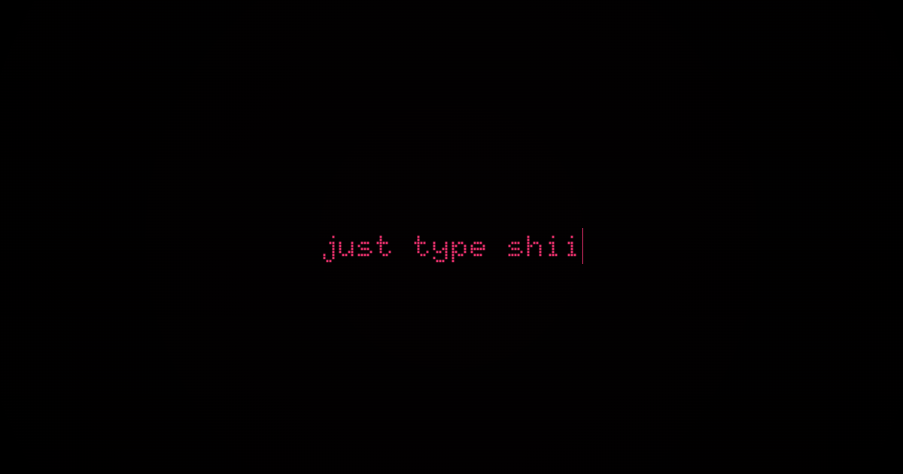

# Imposter Keys Typo - Typing Practice Tool

[](https://just-type-shii.vercel.app/)
[](LICENSE)
[](https://nextjs.org/)
[](https://www.typescriptlang.org/)

> A beautiful, customizable typing practice tool built with Next.js and TypeScript. Practice your typing skills with various fonts, colors, and themes!



## Features

- **Customizable Themes** - Choose from multiple color schemes and backgrounds
- **Font Variety** - Practice with different fonts including decorative and handwriting styles
- **Font Size Control** - Adjust text size to your preference
- **Dark/Light Mode** - Toggle between themes for comfortable typing
- **Responsive Design** - Works perfectly on desktop and mobile devices
- **Real-time Feedback** - Get instant typing statistics and progress
- **Focus Mode** - Distraction-free typing experience
- **Export Options** - Save your typing sessions

## Quick Start

### Prerequisites

- Node.js 18+ 
- npm, yarn, or pnpm

### Installation

1. **Clone the repository**
   ```bash
   git clone https://github.com/Ankitmohanty2/imposter-keys-typo
   cd imposter-keys-typo
   ```

2. **Install dependencies**
   ```bash
   npm install
   # or
   yarn install
   # or
   pnpm install
   ```

3. **Run the development server**
   ```bash
   npm run dev
   # or
   yarn dev
   # or
   pnpm dev
   ```

4. **Open your browser**
   
   Navigate to [http://localhost:3000](http://localhost:3000) to see the application.

## Tech Stack

- **Framework**: [Next.js 14](https://nextjs.org/) - React framework
- **Language**: [TypeScript](https://www.typescriptlang.org/) - Type safety
- **Styling**: [Tailwind CSS](https://tailwindcss.com/) - Utility-first CSS
- **UI Components**: [shadcn/ui](https://ui.shadcn.com/) - Beautiful components
- **Deployment**: [Vercel](https://vercel.com/) - Hosting platform

## Contributing

We love your input! We want to make contributing to **Imposter Keys Typo** as easy and transparent as possible, whether it's:

- Reporting a bug
- Discussing the current state of the code
- Submitting a fix
- Proposing new features
- Becoming a maintainer

### How to Contribute

1. **Fork the repository**
   
   Click the "Fork" button at the top of this repository.

2. **Clone your fork**
   ```bash
   git clone https://github.com/YOUR_USERNAME/imposter-keys-typo
   cd imposter-keys-typo
   ```

3. **Create a feature branch**
   ```bash
   git checkout -b feat/amazing-feature
   # or
   git checkout -b fix/bug-fix
   ```

4. **Install dependencies**
   ```bash
   npm install
   ```

5. **Make your changes**
   
   - Keep the code style consistent
   - Test everything locally before committing
   - If it's UI-related, attach a screenshot in your PR

6. **Commit your changes**
   ```bash
   git add .
   git commit -m "feat: add amazing new feature"
   ```
   
   We use [conventional commits](https://www.conventionalcommits.org/) for clarity.

7. **Push to your branch**
   ```bash
   git push origin feat/amazing-feature
   ```

8. **Open a Pull Request**
   
   - Go to your fork on GitHub and click **"New pull request"**
   - Clearly describe what you changed and why
   - Link to any related issues if possible

### Commit Message Guidelines

We follow the [Conventional Commits](https://www.conventionalcommits.org/) specification:

- `feat:` - A new feature
- `fix:` - A bug fix
- `docs:` - Documentation only changes
- `style:` - Changes that do not affect the meaning of the code
- `refactor:` - A code change that neither fixes a bug nor adds a feature
- `perf:` - A code change that improves performance
- `test:` - Adding missing tests or correcting existing tests
- `chore:` - Changes to the build process or auxiliary tools

## License

This project is licensed under the MIT License - see the [LICENSE](LICENSE) file for details.

## Acknowledgments

- Thanks to all contributors who have helped improve this project
- Inspired by the need for a better typing practice experience
- Built with love for the developer community

---

<div align="center">

⭐ **If you like this project, consider giving it a star on GitHub!** ⭐

[](https://github.com/Ankitmohanty2/imposter-keys-typo)

**Happy typing!**

</div>